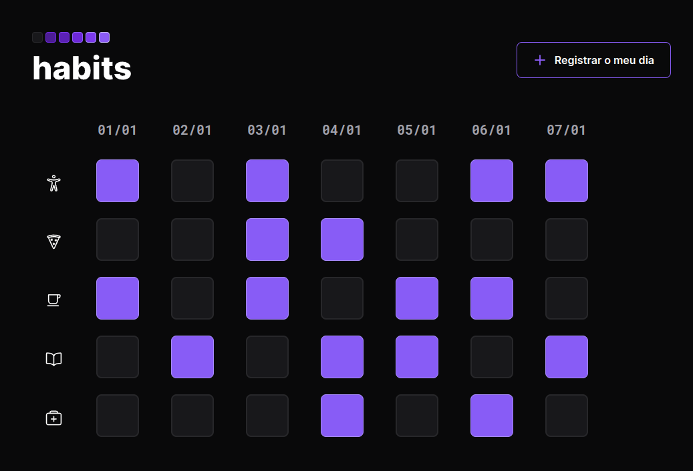

<h1 align="center"> Habits </h1>

NLW é um evento exclusivo e gratuito, promovido pela Rocketseat para ensino de tecnologias WEB.

## 📗️ O que é esse Projeto?:

---

É um projeto que serve para salvar seus habitos do dia-a-dia mostrando para você seus habitos feitos por você no dia anterior e hoje!

## 👀️ Preview:

---

    

## 💻️ Tecnologias:

---

* HTML
* CSS
* JavaScript
* Git & GitHub
* Figma

